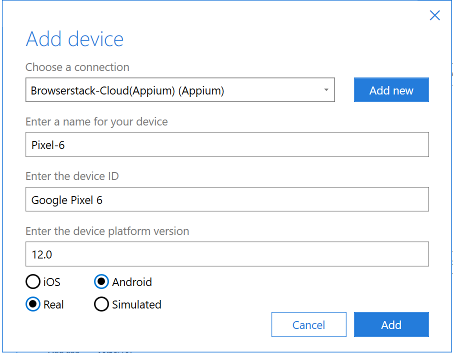

# Tosca Mobile App Scan Example
This is an example repo showing the steps and configuration required to scan a mobile app (Android) using Tricentis Tosca.

I have been able to run this successfully with Tosca v16. But these instructions should be valid for Tosca v15.2 as well. 

## Pre-requisites
You would need the following in order to follow this example:
1. Tricentis Tosca Commander v16.
2. Browserstack Account Subscription.
3. An APK file of mobile application that you would like to scan with Tosca. I used the `JetSurvey` example app from Android repo. Link [here](https://github.com/android/compose-samples/tree/main/Jetsurvey). 

*Note: When you clone the codebase for example app, generate a build APK file for the app in Android Studio. You can find instructions how to generate a APK file [here](https://code.tutsplus.com/tutorials/how-to-generate-apk-and-signed-apk-files-in-android-studio--cms-37927).* 

## Uploading APK file to Browserstack
To upload your APK file to Browserstack, you would need:
1. Your Browserstack `username`
2. Your Browserstack `key`

These can be found in your **Summary** page in Browserserstack. Copy both of these values as you would these to configure Mobile Scan in Tosca as well.

Using `curl` uplaod the APK file by running the following command:
```
curl -u "<username>:<key>" -X POST "https://api-cloud.browserstack.com/app-automate/upload" -F "file=@/temp/Application-debug.apk"
```

Once the upload is complete, you will recieve a `app_url`back from the service. Save this as well as this will be used to configure Tosca.

```
{
    "app_url":"bs://f7c874f21852ba57957a3fdc33f47514288c4ba4",
}
```

## Configuring Tosca for Mobile Scan
1. Open Tosca Commander.
2. Create a new Workspace.
3. Select the `Modules` tab.
4. From the `Modules` menu ribbon, select `Scan->Mobile` option.
5. This will open the `Mobile Scan` screen.
6. Click on `Add Device` button. 
7. On the `Add device` screen, click on `Add New` button. 
8. This will open the `Add connection` screen.
9. Enter connection name. This can be anything you want.
10. From `Type` dropdown, select `Cloud(Appium)` option.
11. In the `Appium Server address` field enter the address as `https://hub-cloud.browserstack.com/wd/hub`.
12. Click `Add` and save the connection.
13. Now back in the `Add device` screen, select the connection you created in previous steps from the `Choose Connection` dropdown.  
14. Enter a name for your device. This can be anything you want. eg., `Pixel6`.
15. In the `Enter the device ID` enter the device name as `Google Pixel 6`. The device names match the names in Browserstack. 
16. In the `Device platform version` field, enter version as `12.0`.
17. Select `Android` and `Real` option buttons. The configured screen should look similar to the below configuraration.

18. Click `Add` to save and close the `Add device` screen.
19. Now on the `Mobile Scan` screen click on the `Add app` button.
20. Select `Navtive/Hybrid` option in the `Add application` screen and click `Continue`.
21. In the `Add native/hybrid application` screen enter a name for the application. eg, `JetSurvey`. In the `PackageName/ActivityName` enter `com.example.compose.jetsurvey/MainActivity`. This is app specific information and can be found in the App repo linked earlier in Pre-Requisites section. The configuration should look similar to the below config.
.
22. Click `Add` to save and close the screen. 
23. Now click on `Advanced Configuration` button to open `Advanced configuration` screen. This is where we will configure our connection to Browserstack and app details that you uploaded previously.

24. Click on `Add Capabilities Set` button. This will add a new line in the left window pane. Enter the name as `Browserstack`.
25. Now click on and select the newly created `Browserstack` capability set name and click `Add Capability` button. 
26. Now under the `Desired Capability` table on the right, add the following capabilities. For `app_url` value, add the url that Browserstack upload API responded with when you uploaded the app. 

|   Desired Capability  |   Value                                           |
|   :------------------  |   :--------------                                |
|   browserstack.user   |   `browserstack username`                         |
|   browserstack.key    |   `browserstack key`                              |
|   platformVersion     |   `12.0`                                          |
|   app_url             |   `bs://f7c874f21852ba57957a3fdc33f47514288c4ba4` |
|   device              |   `Google Pixel 6`                                |

27. The configuration should look similar to the below config.
 
28. Click `Add` to save this configuration.

## Running Mobile Scan
1. After configuring the Mobile Scan. Select the newly added device and the added application. Once these two are selected, also open the `Advanced Configuration` screen again, select the `Browserstack` capability set created earlier and click on `Add`. (Doing this to make sure that Tosca selects this specific capability set for the App that you have creted and want to scan).

2. Click on `Connect` button. This will show a `Establishing connection` screen as below.

3. Click on `Scan` button and this will open the `Connection Established` screen with the App loaded up in the Tosca mobile app viewer as shown below.

4. Now click on the `Scan` button and this will open the `Mobile App - XScan` screen as shown below. 


You can now select the elements in the scan window and save it to the module just like would do for scanning any other application with Tosca. 